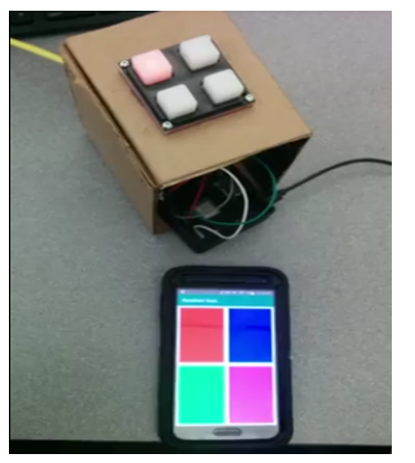
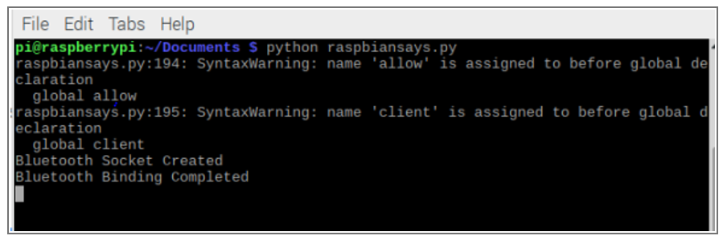
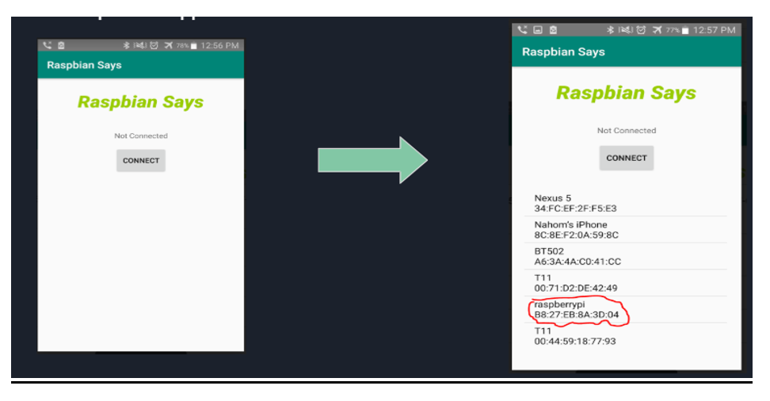
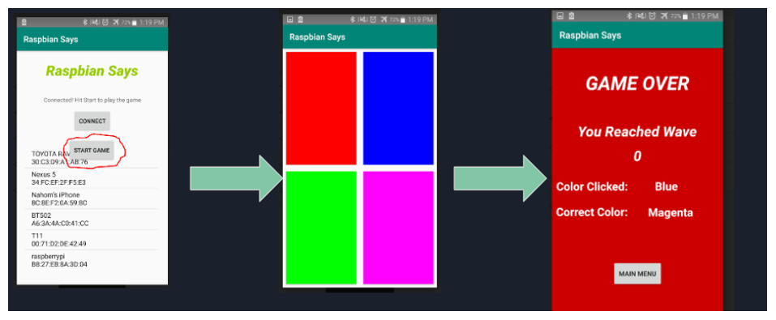

# Raspbian-Says
### **by Nahom Getabneh and Prince Nhliziyo**

This project is an implementation of the game, Simon Says, on a Raspberry Pi where a user uses an android phone to communicate with the Raspberry Pi and play the game. 

Here is a link to a quick youtube vido of the project
https://youtu.be/OhkPVo8DCCg

To get started, first go to "Hardware Implementation.docx" and look at the guide on how to implement the hardware part of the application then, follow this instruction on how to run and play the game

Install Raspbian OS on to the Raspberry PI, if you have not done so. Here is the instruction to install Raspbian
https://thepi.io/how-to-install-raspbian-on-the-raspberry-pi/

Then, turn on bluetooth, on both android device and Raspberry PI, and go to  their bluetooth settings and pair them if you haven’t done so. Here is more information on how to pair your android phone with Raspberry Pi: https://bluedot.readthedocs.io/en/latest/pairpiandroid.html

After successfully pairing, install the app, Raspbian Says, on your android device. The link for the .apk file is here (https://drive.google.com/drive/folders/1Z8oy9UaGwFUshVjnHY72qD5G36TyAcrT?usp=sharing). You can also run the source code for the android app using android studio.

Before opening the app do the following on the Raspberry PI

First save the two .py files (cleanup.py and raspbiansays.pi) located under folder, “Python Code for Raspberry”, in your document section of your Raspberry PI

Once you have successfully made the board and connected the board to raspberry PI (Look at “Implementation” in “Project Report.docx”)

Open the terminal on Raspberry PI then run the commands

   ●	Cd Documents (or the folder where you saved cleanup.py and raspbiansays.py)

   ●	python cleanup.py  (Do this every time before running  raspbiansays.py)

   ●	python raspbiansays.py

If you see this on the terminal then your raspberry has successfully created a server and is waiting for an android phone to accept as a client.

Then go to the android phone and open the Raspbian Says app.

   ●	Click “Connect” and a list of all your paired devices will appear.
   
   ●	Select raspberrypi under the list of available devices to connect to the socket on the raspberry PI

**Playing the game** 

   ●	If the Raspberry PI accepts your android device, a “Start Game” button will appear on the android app, where it can be clicked to start the game. 

After clicking Start Game, the LED lights will start to turn on.

You pass a stage by correctly clicking the correct color sequence that the colors on the LED have shown

Everytime you pass stage, all led turn green and one more random color will be added to the sequence

If you make mistake when , all led turn blue and the game will stop and you will be shown the “Game Over” screen and your score along with the correct color you should have clicked, and the color you clicked instead.

Once you have finished, you can click main menu which will direct you the first menu when you opened the app and it close the socket with the Raspberry PI

On the Raspberry PI side, you don’t need to run the code again to create a server. It will create another server for you automatically. You just have to repeat the process of connecting to the socket on your android phone, if you wish to play the game again.   

